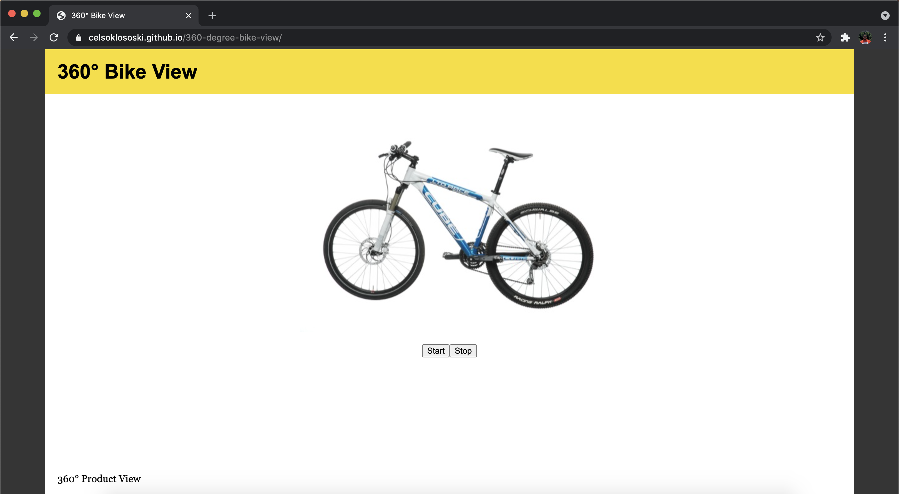

# 360° Bike View with JavaScript

Project developed during the JavaScript course held at the BCIT institution in the Applied Web Development program. The project was developed in JavaScript, HTML and CSS. The purpose of the project was to develop a page where the user sees a bicycle in a 360 degree view by clicking on the start button. A pop-up with instructions appears if the user does not click the start button within 3 seconds.

